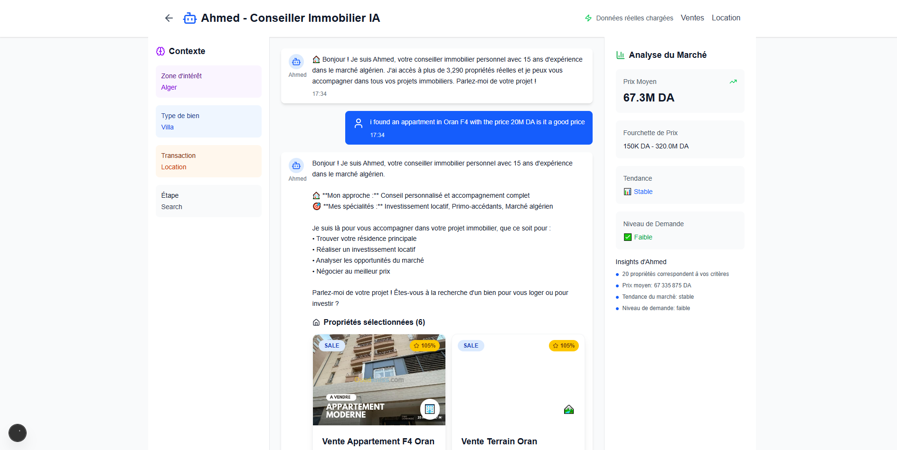

# Plateforme Immobilière Intelligente - Algérie

Une plateforme immobilière complète pour l'Algérie intégrant l'intelligence artificielle pour offrir une expérience utilisateur optimale. Cette solution combine recherche avancée, chatbot conversationnel intelligent, et analyses de marché en temps réel.

## Vue d'ensemble

Cette plateforme web moderne propose :
- **Moteur de recherche immobilier avancé** avec filtres multi-critères
- **Chatbot IA conversationnel** offrant des conseils personnalisés d'agent immobilier
- **Analyses de marché en temps réel** avec visualisations interactives
- **Système de recommandations intelligent** basé sur les préférences utilisateur
- **Insights spécifiques par wilaya** couvrant toutes les régions d'Algérie

## Captures d'écran

### Page d'accueil

*Interface principale de la plateforme avec navigation vers les différents modules*

### Chatbot Intelligent "Ahmed"

*Interface conversationnelle avec l'assistant IA spécialisé en immobilier*

### Tableau de bord - Ventes

*Analytics et visualisations des données de vente immobilière*

### Tableau de bord - Locations

*Analyses et statistiques du marché locatif algérien*

## Technologies utilisées

### Frontend et Interface Utilisateur
- **Next.js 15.5.4** avec App Router pour une architecture moderne
- **React 19** avec hooks avancés pour la gestion d'état
- **TypeScript** pour la sécurité de type et la maintenabilité
- **Tailwind CSS 4** pour un design responsive et moderne
- **Framer Motion** pour les animations fluides
- **Radix UI** pour des composants accessibles et robustes
- **Lucide React** pour une iconographie cohérente

### Visualisations et Graphiques
- **Recharts** pour tous les types de graphiques (barres, secteurs, lignes)
- **Cartes interactives** de l'Algérie avec distribution géographique des biens
- **Tableaux de bord** avec indicateurs de performance en temps réel

### Intelligence Artificielle et Chatbot
- **Moteur de recherche sémantique** personnalisé avec algorithme de scoring avancé
- **Système de recommandations** utilisant KNN et analyse comportementale
- **Chatbot conversationnel** avec personnalité définie et mémoire contextuelle
- **Analyses prédictives** pour les tendances de marché
- **Traitement du langage naturel** pour la compréhension des requêtes en français

### Gestion et Traitement des Données
- **Papa Parse** pour le traitement des fichiers CSV de propriétés
- **Axios** pour les communications API
- **Techniques d'imputation avancées** utilisant KNN et Random Forest
- **Pipeline de nettoyage de données** automatisé avec Python

## Architecture et Fonctionnement

### Chatbot Intelligent "Ahmed"
Le système de chatbot intègre :
- **Mémoire contextuelle** des préférences utilisateur (budget, localisation, type de bien)
- **Analyse de profil** automatique (primo-accédant, investisseur, famille)
- **Conseils personnalisés** adaptés à chaque wilaya
- **Questions de suivi intelligentes** pour affiner les recherches
- **Base de connaissances** spécialisée sur le marché immobilier algérien

### Recherche Sémantique Avancée
Le système de recherche utilise un algorithme de scoring sophistiqué :
```typescript
// Critères de scoring :
- Correspondance géographique (coefficient x20 pour correspondance exacte)
- Type de propriété (appartement, villa, maison, terrain)
- Compatibilité budget et surface (tolérance de 30%)
- Analyse sémantique de la description
- Intégration des tendances de marché actuelles
```

### Analyses de Marché
- **Calcul automatique** des prix moyens par wilaya et commune
- **Détection des tendances** de marché (croissance, stabilité, déclin)
- **Analyse de la demande** avec classification (élevée, modérée, faible)
- **Insights géographiques** spécifiques (Hydra, Bir El Djir, Ali Mendjeli, etc.)

## Installation et Configuration

```bash
# Cloner le repository
git clone [repository-url]
cd real-estate-platform

# Installation des dépendances
npm install

# Lancement en mode développement avec Turbopack
npm run dev

# Alternative avec Yarn
yarn dev
```

Accéder à l'application : [http://localhost:3000](http://localhost:3000)

## Structure du Projet

```
src/
├── app/                    # Pages Next.js (App Router)
│   ├── chat/              # Interface du chatbot conversationnel
│   ├── sales/             # Module de gestion des ventes
│   └── rental/            # Module de gestion des locations
├── components/            # Composants React réutilisables
│   ├── PropertyCard.tsx   # Composant d'affichage de propriété
│   ├── PropertyFilters.tsx # Système de filtres avancés
│   └── AlgerianMap.tsx    # Carte interactive de l'Algérie
├── lib/                   # Logique métier et utilitaires
│   ├── chatbot-engine.ts  # Moteur d'intelligence artificielle
│   ├── data.ts           # Gestionnaire de données
│   └── utils.ts          # Fonctions utilitaires
└── types/                # Définitions TypeScript
```

## Fonctionnalités Principales

### Chat Conversationnel Intelligent
- Conversation naturelle en langue française
- Mémoire contextuelle des interactions précédentes
- Conseils personnalisés selon le profil utilisateur
- Analyses spécifiques par région administrative

### Recherche et Filtrage
- Filtres multi-critères (prix, surface, localisation, type)
- Recherche sémantique avec intelligence artificielle
- Tri par pertinence, prix, et autres critères
- Système de comparaison de biens immobiliers

### Analytics et Visualisations
- Tableau de bord avec indicateurs clés de performance
- Graphiques interactifs utilisant Recharts
- Cartographie de distribution géographique
- Analyses prédictives et tendances de marché

### Spécialisation Marché Algérien
- Couverture complète des 58 wilayas
- Insights détaillés par ville et commune
- Connaissance approfondie du marché local
- Conseils adaptés au contexte réglementaire algérien

## Scripts de Développement

```bash
npm run dev          # Serveur de développement avec Turbopack
npm run build        # Construction pour la production
npm run start        # Serveur de production
npm run lint         # Vérification de la qualité du code
```

## Roadmap et Développement du Projet

### Phase 1 : Collecte et Traitement des Données (Complétée)
Le projet a débuté par une phase cruciale de collecte de données immobilières algériennes. Cette étape s'est révélée particulièrement complexe :

- **Web Scraping Initial** : Développement de scripts Python pour extraire les données depuis diverses plateformes immobilières algériennes
- **Défis Techniques Rencontrés** :
  - Gestion des différents formats de données entre plateformes
  - Normalisation des informations géographiques (wilayas, communes)
  - Traitement des prix en différentes devises (DZD, EUR)

- **Pipeline de Nettoyage** : Création d'un système robuste de nettoyage et validation des données
  - Détection et correction des doublons
  - Imputation des valeurs manquantes avec KNN et Random Forest
  - Standardisation des formats d'adresses et types de propriétés
  - Validation de la cohérence prix/surface/localisation

### Phase 2 : Architecture et Développement (Complétée)
- **Choix Technologiques** : Sélection de Next.js 15 pour les performances et React 19 pour les fonctionnalités avancées
- **Développement du Moteur IA** : Création d'un système de recherche sémantique personnalisé
- **Interface Utilisateur** : Design responsive avec Tailwind CSS et composants Radix UI
- **Chatbot Conversationnel** : Développement d'Ahmed avec personnalité et mémoire contextuelle

### Phase 3 : Optimisations et Fonctionnalités Avancées (En Cours)
- **Analyses Prédictives** : Modèles de machine learning pour prédire les tendances de prix
- **Géolocalisation Avancée** : Intégration de cartes interactives avec données de quartiers
- **Système de Recommandations** : Algorithmes personnalisés basés sur le comportement utilisateur

## Contribution au Projet

Pour contribuer au développement :
1. Fork du repository principal
2. Création d'une branche feature (`git checkout -b feature/nouvelle-fonctionnalite`)
3. Commit des modifications (`git commit -m 'Ajout de nouvelle fonctionnalité'`)
4. Push vers la branche (`git push origin feature/nouvelle-fonctionnalite`)
5. Création d'une Pull Request

## Licence et Droits d'Auteur

Ce projet est développé dans le cadre de l'innovation technologique pour le marché immobilier algérien.

**Stack Technologique :** Next.js 15 + React 19 + TypeScript + Tailwind CSS + IA Personnalisée + Recharts + Radix UI